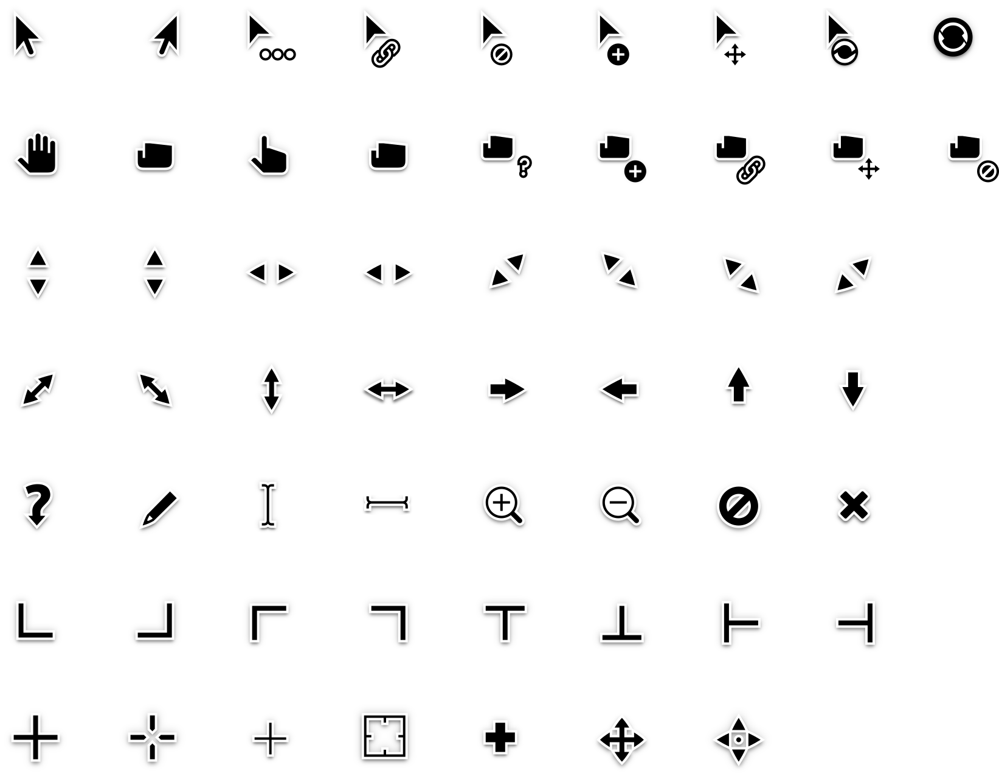
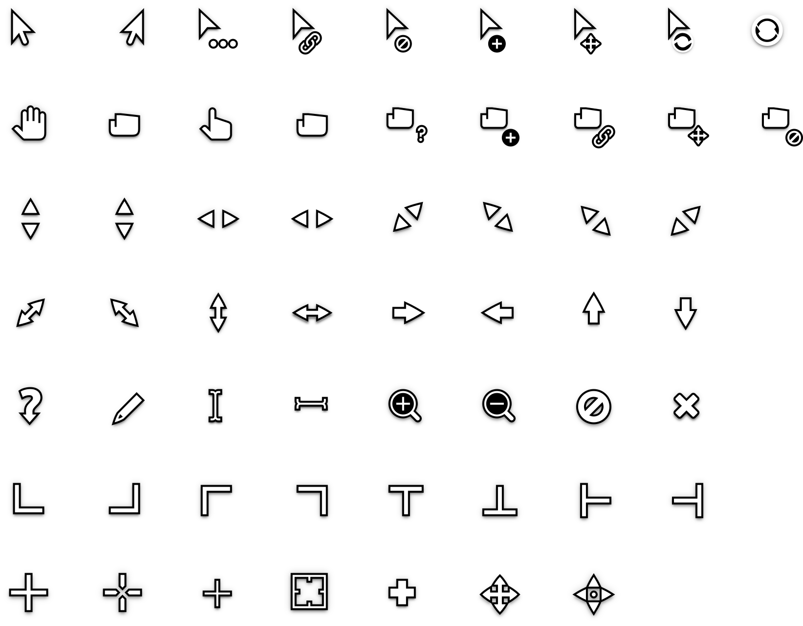

Quintom Cursors
====================

This is an x-cursor theme designed to look decent.

## Preview



## Preview (White)



## Copying or Reusing

This project has mixed licencing. You are free to copy, redistribute and/or modify aspects of this work under the terms of each licence accordingly (unless otherwise specified).

The Quintom cursor assets (any and all source `.svg` files or rendered `.png` files) are licenced under the terms of the [Creative Commons Attribution-ShareAlike 4.0 License](https://creativecommons.org/licenses/by-sa/4.0/).

Included scripts are free software licenced under the terms of the [GNU General Public License, version 3](https://www.gnu.org/licenses/gpl-3.0.txt).

## Installing & Using

You can install Quintom by copying the Quintom or Quintom_White folder to your icons folder.

To install the cursor theme, cd into the downloaded directory, then simply copy the compiled theme to your icons
directory. For local user installation:

```
cp -r 'Quintom Cursors/Quintom' ~/.icons
```
or

```
cp -r 'Quintom_Snow Cursors/Quintom_Snow' ~/.icons
```


For system-wide installation for all users:

```
sudo cp -r 'Quintom Cursors/Quintom' /usr/share/icons
```
or

```
sudo cp -r 'Quintom_Snow Cursors/Quintom_Snow' /usr/share/icons
```

Then set the theme with your preferred desktop tools.

## Contributing

Contributions are obviously welcome! If you would like to contribute to this project, please have [read this](/CONTRIBUTING.md) regarding contributions.
